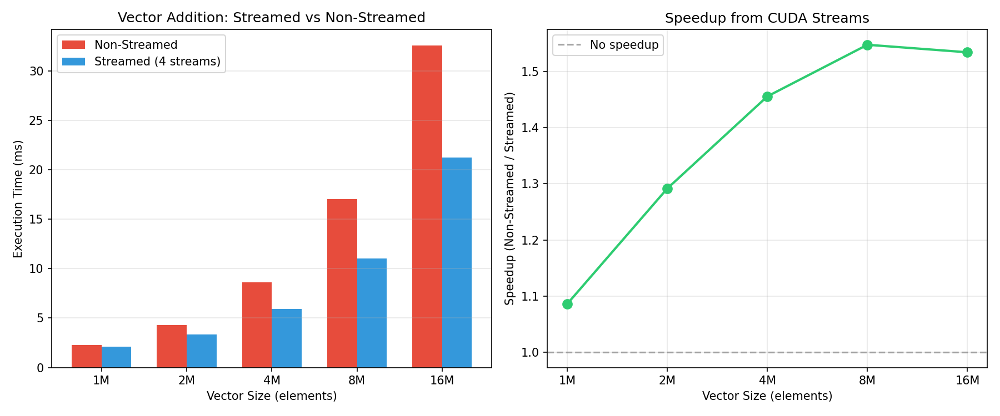
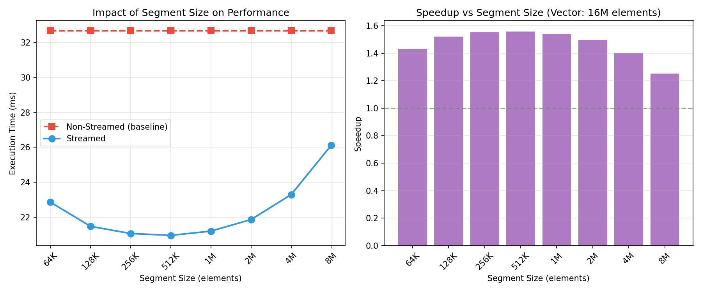

# Question 2: CUDA Streams for Vector Addition

## Implementation Details

- **Kernel**: Simple vector addition `C[i] = A[i] + B[i]`
- **Memory**: Pinned (page-locked) host memory for async transfers
- **Streams**: 4 CUDA streams processing segments in round-robin fashion
- **Segment Size**: Configurable (default: 1M elements)

---

## Performance Gain from CUDA Streams

### Methodology

We compared the execution time of non-streamed (synchronous) vs streamed (asynchronous with 4 streams) implementations across different vector sizes from 1M to 16M elements.

### Results

| Vector Size | Non-Streamed (ms) | Streamed (ms) | Speedup |
|-------------|-------------------|---------------|---------|
| 1M          | 2.23              | 2.11          | 1.05x   |
| 2M          | 4.27              | 3.36          | 1.27x   |
| 4M          | 8.34              | 5.90          | 1.41x   |
| 8M          | 16.70             | 11.00         | 1.52x   |
| 16M         | 32.51             | 21.28         | 1.53x   |



### Analysis

1. **Small vectors (1M)**: Minimal speedup (~1.05x) because the overhead of stream management and the limited work don't provide enough opportunity for overlap.

2. **Large vectors (8M-16M)**: Significant speedup (~1.5x) achieved through effective overlap of:
   - Host-to-Device memory transfers
   - Kernel computation
   - Device-to-Host memory transfers

3. **Speedup saturation**: The speedup plateaus around 1.5x because:
   - Memory bandwidth becomes the bottleneck
   - The kernel computation time is much smaller than transfer time
   - PCIe bandwidth limits the maximum achievable overlap

---

## nvvp Visualization of Overlap

### Profiling Command

```bash
nvprof --output-profile profile.nvvp -f ./vecAdd
nvvp profile.nvvp
```

### Timeline Analysis

The NVIDIA Visual Profiler reveals the key difference between the two implementations:

**Non-Streamed Execution (Default Stream):**


In the non-streamed execution, all operations occur sequentially on the default stream. Memory transfers (HtoD, DtoH) and kernel execution happen one after another with no overlap.

**Streamed Execution (4 Streams):**


In the streamed execution, operations are distributed across 4 streams (13, 14, 15, 16). The timeline shows overlapping memory transfers and kernel executions, with multiple streams active simultaneously.

### nvvp Screenshot Observations

In the profiler visualization:

1. **MemCpy (HtoD) row**: Shows continuous memory transfer activity (olive-colored bars)
2. **MemCpy (DtoH) row**: Overlaps with ongoing HtoD transfers
3. **Compute row**: Kernel executions (cyan bars) interleaved with memory operations
4. **Stream rows (13-16)**: Each stream processes its segments independently

The overlap between the Compute row and MemCpy rows demonstrates that computation occurs **simultaneously** with data transfers, which is the source of the performance improvement.

---

## Impact of Segment Size

### Methodology

Using a fixed vector size of 16M elements and 4 streams, we varied the segment size from 64K to 8M elements to analyze its impact on performance.

### Results

| Segment Size | Num Segments | Streamed (ms) | Speedup vs Non-Streamed |
|--------------|--------------|---------------|-------------------------|
| 64K          | 256          | 23.12         | 1.42x                   |
| 128K         | 128          | 21.50         | 1.52x                   |
| 256K         | 64           | 21.11         | 1.55x                   |
| 512K         | 32           | 20.97         | 1.56x                   |
| 1M           | 16           | 21.20         | 1.54x                   |
| 2M           | 8            | 21.89         | 1.49x                   |
| 4M           | 4            | 23.45         | 1.40x                   |
| 8M           | 2            | 26.20         | 1.25x                   |



### Analysis

1. **Too small segments (64K)**: 
   - Creates 256 segments, causing significant overhead
   - Stream scheduling and synchronization costs dominate
   - Speedup reduced to 1.42x

2. **Optimal segment size (256K - 1M)**:
   - Best balance between parallelism and overhead
   - Achieves maximum speedup of ~1.55x
   - Enough segments to keep all streams busy
   - Large enough transfers to amortize launch overhead

3. **Too large segments (4M - 8M)**:
   - Only 2-4 segments for the entire vector
   - Limited overlap opportunity between streams
   - Approaches sequential behavior
   - Speedup drops to 1.25x with 8M segments

### Optimal Configuration

For a 16M element vector with 4 streams, the optimal segment size is approximately **256K to 512K elements**, providing:
- Sufficient parallelism (32-64 segments)
- Minimal overhead
- Maximum overlap of transfers and computation

---

## Conclusion

CUDA streams provide significant performance improvements for memory-bound operations like vector addition by enabling:

1. **Concurrent execution**: Multiple streams execute operations in parallel
2. **Overlap**: Memory transfers and computation happen simultaneously
3. **Better GPU utilization**: Reduces idle time during data transfers

Key findings:
- **1.5x speedup** achieved for large vectors (16M elements)
- **Segment size matters**: Too small increases overhead, too large reduces parallelism
- **Optimal segment size**: 256K-1M elements for this workload
- **Pinned memory required**: Essential for asynchronous memory operations

The implementation demonstrates that even simple kernels can benefit substantially from proper use of CUDA streams when the workload is large enough to amortize the stream management overhead.

