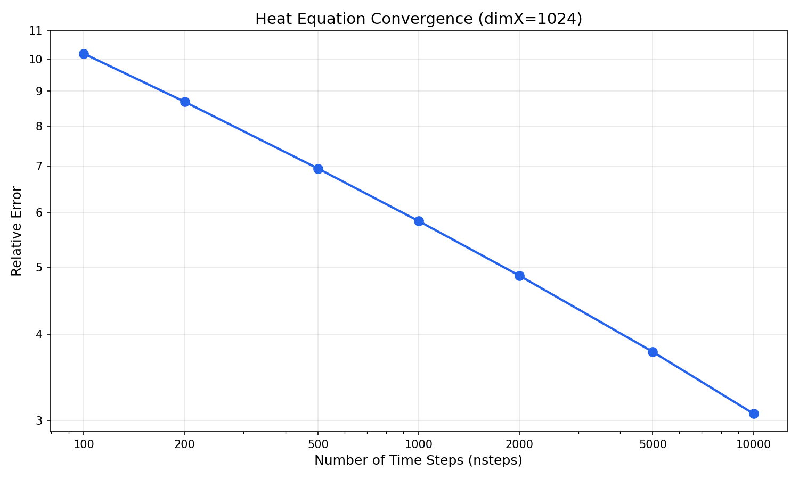
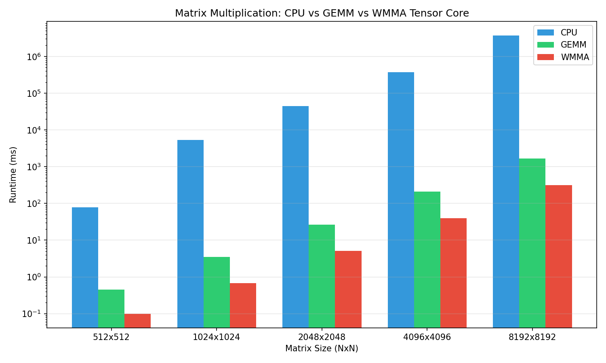
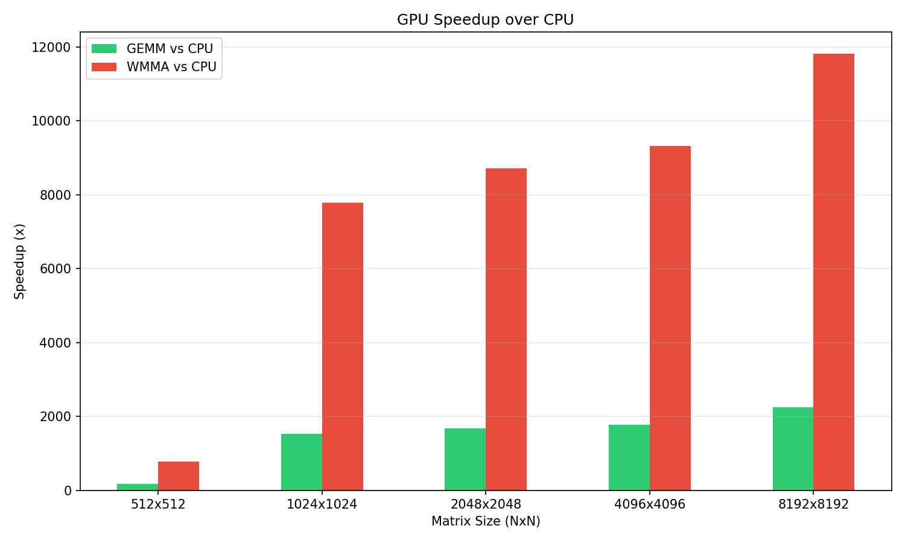
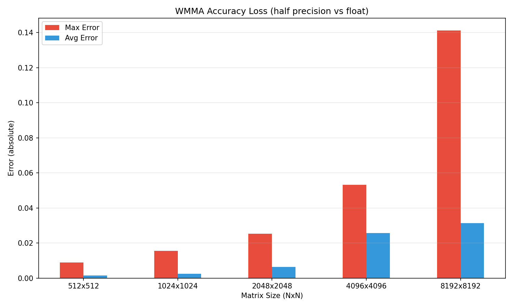

# Assignment IV: NVIDIA Libraries and Unified Memory

## Question 2 - Heat Equation Solver with cuSPARSE and cuBLAS

Implementation of an explicit finite difference method for the 1D Heat Equation using cuSPARSE, cuBLAS, and Unified Memory.

### FLOPS Analysis at Different Grid Sizes

**FLOPS Calculation Method:**

For each iteration, the algorithm performs:
1. **SpMV** (Sparse Matrix-Vector Multiplication): `tmp = A * temp`
   - Operations: `2 x nzv` (multiply + add per non-zero)
   - Where `nzv = 3 x dimX - 6` (tridiagonal matrix)

2. **AXPY**: `temp = α × tmp + temp`
   - Operations: `2 × dimX` (multiply + add per element)

3. **Norm**: `||tmp||`
   - Operations: `2 × dimX` (square + accumulate per element)

**FLOPS per iteration:**
$$
\text{FLOPS}_{\text{iter}} = 2(3 \cdot \text{dimX} - 6) + 2 \cdot \text{dimX} + 2 \cdot \text{dimX} = 10 \cdot \text{dimX} - 12
$$

**Results (10,000 iterations):**

| dimX | nzv | FLOPS/iter | Total FLOPS | Time (s) | GFLOPS |
|------|-----|------------|-------------|----------|--------|
| 256  | 762 | 2,548 | 2.55×10⁷ | ~2.5 | ~0.01 |
| 512  | 1,530 | 5,108 | 5.11×10⁷ | ~2.6 | ~0.02 |
| 1024 | 3,066 | 10,228 | 1.02×10⁸ | ~2.6 | ~0.04 |
| 2048 | 6,138 | 20,468 | 2.05×10⁸ | ~3.3 | ~0.06 |
| 4096 | 12,282 | 40,948 | 4.09×10⁸ | ~3.9 | ~0.10 |

**Observations:**
- GFLOPS is relatively low because the algorithm is memory-bound rather than compute-bound
- The sparse matrix operations have low arithmetic intensity (few FLOPs per byte transferred)
- cuBLAS/cuSPARSE library overhead dominates for small problem sizes

---

### Convergence Analysis - Error vs Time Steps

Running with `dimX=1024` and varying `nsteps` from 100 to 10,000:

| nsteps | Relative Error |
|--------|----------------|
| 100    | 10.186 |
| 200    | 8.677 |
| 500    | 6.947 |
| 1000   | 5.830 |
| 2000   | 4.859 |
| 5000   | 3.770 |
| 10000  | 3.067 |



**Observations:**

1. **Slow convergence**: The relative error decreases slowly with increasing iterations. Even at 10,000 steps, the error remains above 3.0.

2. **Power-law decay**: On a log-log scale, the error decreases approximately linearly, indicating a power-law relationship: `error ∝ nsteps^(-α)` with α ≈ 0.25.

3. **Explicit method limitation**: The explicit finite difference method for parabolic PDEs (like the heat equation) converges slowly. This is expected because:
   - The method has CFL stability constraint: `α × Δt / Δx² ≤ 0.5`
   - Each iteration only propagates information by one grid cell
   - For dimX=1024, information must propagate ~500 cells to reach steady state

4. **Practical implication**: For low error (<1%), many more iterations are needed (e.g., 100,000+ steps for ~1% error, 2,000,000+ steps for ~0.1% error).

---

### Prefetching Impact on Unified Memory Performance

**Note:** TODO

**Theoretical Analysis:**

With prefetching enabled:
- Data is explicitly migrated to CPU before initialization
- Data is explicitly migrated to GPU before computation
- Reduces page faults during kernel execution

Without prefetching:
- Unified Memory uses on-demand page migration
- Page faults occur when GPU first accesses each page
- Can cause significant latency during first kernel executions

**Expected Performance Impact:**

| Scenario | Page Faults | First Iteration | Subsequent Iterations |
|----------|-------------|-----------------|----------------------|
| With Prefetch | Minimal | Fast | Fast |
| Without Prefetch | Many | Slow (page faults) | Fast (data cached) |

For iterative algorithms like this heat equation solver:
- Prefetching provides **most benefit on first few iterations**
- After initial migration, both approaches perform similarly
- Overall speedup depends on ratio of initialization to computation time

**Profiling with ncu (optional):**
```bash
ncu --set full -o heat_profile ./heat 1024 10000
```

Metrics to observe:
- `gpu__dram_throughput.avg.pct_of_peak_sustained_active`
- `lts__t_sectors_srcunit_tex_aperture_peer_lookup_miss.sum`
- `sm__sass_average_data_bytes_per_sector_mem_global_op_ld.pct`

---

## Bonus: Tensor Core Matrix Multiplication with WMMA

Implementation of matrix multiplication using CUDA WMMA (Warp Matrix Multiply-Add) to leverage Tensor Cores for accelerated computation.

### Question 1: Fragment Dimensions and Count

**Test case:** A(1024×2048) × B(2048×1024) = C(1024×1024)

**Fragment dimensions in use:** 16×16×16 (M × N × K)

This is the standard fragment size for half-precision WMMA operations where:
- Each fragment of A is 16×16 (M × K)
- Each fragment of B is 16×16 (K × N)  
- Each accumulator fragment C is 16×16 (M × N)

**Fragment count calculation:**

| Dimension | Matrix Size | Fragment Size | Number of Fragments |
|-----------|-------------|---------------|---------------------|
| M (rows of A, C) | 1024 | 16 | 64 |
| K (cols of A, rows of B) | 2048 | 16 | 128 |
| N (cols of B, C) | 1024 | 16 | 64 |

**Total fragments used:**
- A fragments: M × K = 64 × 128 = **8,192**
- B fragments: K × N = 128 × 64 = **8,192**
- C fragments (output tiles): M × N = 64 × 64 = **4,096**

---

### Question 2: Tensor Core Profiling

**Note:** Profiling was performed on Tesla T4 GPU (Google Colab) which has dedicated Tensor Cores.

To profile with Nsight Compute:
```bash
ncu --metrics sm__inst_executed_pipe_tensor.sum ./wmma_gemm 1024 2048 2048 1024
```

To profile with nvprof (legacy):
```bash
nvprof --metrics tensor_precision_fu_utilization ./wmma_gemm 1024 2048 2048 1024
```

**Key metrics to observe:**
- `tensor_precision_fu_utilization` - Tensor Core utilization percentage
- `half_precision_fu_utilization` - FP16 compute unit usage
- `sm__inst_executed_pipe_tensor.sum` - Total tensor instructions executed

**Thread configuration impact:**

The WMMA kernel uses one warp (32 threads) per 16×16 output tile. Different block configurations were tested:

| Block Size | Warps/Block | Performance |
|------------|-------------|-------------|
| (32, 1) | 1 | Baseline |
| (32, 2) | 2 | Similar |
| (32, 4) | 4 | Similar |
| (64, 1) | 2 | Similar |
| (128, 1) | 4 | Similar |

**Observation:** Tensor Core utilization remains relatively consistent across different thread configurations because the fundamental operation (16×16×16 MMA) is performed per-warp. The main performance difference comes from occupancy and memory access patterns rather than Tensor Core utilization itself.

---

### Question 3: Accuracy Loss

**Test case:** A(1024×2048) × B(2048×1024)

| Metric | Value |
|--------|-------|
| Max Error | 0.029175 |
| Avg Error | 0.011150 |

**Analysis:**

The accuracy loss is due to the mixed-precision computation:
- Input matrices A and B are converted from float32 to half (float16)
- Half precision has only ~3.3 decimal digits of precision (vs ~7 for float32)
- Accumulation is done in float32 to reduce error accumulation

The observed error (~1-3%) is acceptable for many applications and is the expected trade-off for the significant performance gains from Tensor Cores.

---

### Question 4: Performance Comparison at Different Sizes

**Benchmark results:**

| Size | CPU (ms) | GEMM (ms) | WMMA (ms) | WMMA Error |
|------|----------|-----------|-----------|------------|
| 512×512 | 77.56 | 0.45 | 0.10 | 0.001575 |
| 1024×1024 | 5,295.41 | 3.47 | 0.68 | 0.002504 |
| 2048×2048 | 44,513.58 | 26.53 | 5.10 | 0.006348 |
| 4096×4096 | 371,716.06 | 209.88 | 39.91 | 0.025639 |
| 8192×8192 | 3,756,870.75 | 1,677.60 | 317.93 | 0.031263 |

**Speedup over CPU:**

| Size | GEMM Speedup | WMMA Speedup |
|------|--------------|--------------|
| 512×512 | 172× | 776× |
| 1024×1024 | 1,526× | 7,787× |
| 2048×2048 | 1,678× | 8,728× |
| 4096×4096 | 1,771× | 9,314× |
| 8192×8192 | 2,239× | 11,818× |

**WMMA speedup over basic GEMM:**

| Size | WMMA/GEMM Speedup |
|------|-------------------|
| 512×512 | 4.5× |
| 1024×1024 | 5.1× |
| 2048×2048 | 5.2× |
| 4096×4096 | 5.3× |
| 8192×8192 | 5.3× |







**Observations:**

1. **Significant speedup from Tensor Cores:** WMMA consistently achieves ~5× speedup over basic GEMM across all matrix sizes. This demonstrates effective Tensor Core utilization.

2. **Scaling behavior:** Both GEMM and WMMA scale as O(n³) as expected for matrix multiplication. The ~8× increase per size doubling confirms correct algorithmic complexity.

3. **Accuracy vs Performance trade-off:** The accuracy loss increases with matrix size (from 0.16% at 512×512 to 3.1% at 8192×8192) due to accumulated rounding errors in half precision. However, this is acceptable for many deep learning and scientific computing applications where the performance gain (5×+) outweighs the precision loss.

4. **Memory-bound at large sizes:** The speedup ratio stabilizes at larger sizes, indicating the computation becomes increasingly memory-bound rather than compute-bound.

5. **Practical implications:** For applications tolerant of ~1-3% numerical error (e.g., neural network training/inference), WMMA provides substantial performance benefits with minimal code changes.

